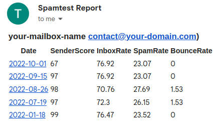

# spamtest

- Check your Email Deliverability (test if your emails are being delivered to Inbox or Spam folder at Gmail, Outlook and etc).
- Check your Sender Score of your Email Server (IP reputation)
- Supports multiple accounts
- Run tests by schedule
- Receive email reports

### Here is how email report looks like:


## Prepare files

#### accounts.json
Define your SMTP accounts here in the following format:
```
[
  {
    "note": "gsuite my email",
    "dsn": "smtp://my@email.com:pA$$wOrD@smtp.gmail.com:587",
    "fromName": "Sender name",
    "fromEmail": "my@email.com"
  }
]
```
The password must be urlencoded (%2B instead of +, %20 instead of space and etc).

#### body.html

Put your email contents into this file.

## Getting started with docker-compose

This setup runs a glockapps tests with email report by a cron schedule once a week.
Create a file called docker-compose.yml with the content below:
```
version: "3.2"

services:
  spamtest:
    image: karser/spamtest:latest
    restart: unless-stopped
    environment:
      GLOCKAPPS_KEY: 'XXXXXXXXX'
      ACCOUNTS_PATH: '/accounts.json'
      SUBJECT: 'Your test email subject'
      BODY_PATH: '/body.html'
      REPORT_DSN: 'smtp://my@email.com:pA$$wOrD@smtp.gmail.com:587'
      REPORT_FROM_EMAIL: 'my@email.com'
      REPORT_FROM_NAME: 'Spamtest'
      RECIPIENT_EMAIL: 'your@email.com,your-second@email.com'
      CRON_CONFIG: |
        0 0 * * 1 /var/app/bin/console app:spamtest >> /var/log/cron.log 2>&1
        0 8 * * 1 /var/app/bin/console app:report >> /var/log/cron.log 2>&1
    volumes:
      - ./body.html:/body.html:ro
      - ./accounts.json:/accounts.json:ro
    command: ['/usr/local/bin/cron-entrypoint']
```

#### Run this and get into the container:
```
docker-compose up -d
docker exec -it spamtest_spamtest_1 sh
```

#### Verify accounts without creating a glockapps test
First you want to make sure that your accounts config is correct and emailable.
```
bin/console app:spamtest --verify
```
If the previous command was executed successfully check your mailbox that you specified in RECIPIENT_EMAIL variable.

#### Then let's run a spam test:
```
bin/console app:spamtest
```

#### Send email report
After a while run the report script
```
bin/console app:report
```

## Getting started without docker

#### Clone the repo and install dependencies
```
git clone
composer install
```

#### Verify accounts without creating a glockapps test
First you want to make sure that your accounts config is correct and emailable.
```
bin/console app:spamtest \
  --verify --recipient-email=your@email.com \
  --accounts-path=/path/to/accounts.json \
  --subject='Your test email subject' \
  --body-path=/path/to/body.html
```

#### Run a glockapps test
```
bin/console app:spamtest \
  --glockapps-key=XXXXXXXXX
  --accounts-path=/path/to/accounts.json \
  --subject='Your test email subject' \
  --body-path=/path/to/body.html
```

#### Send email report
```
bin/console app:spamtest \
  --glockapps-key=XXXXXXXXX
  --accounts-path=/path/to/accounts.json \
  --report-dsn='smtp://my@email.com:pA$$wOrD@smtp.gmail.com:587' \
  --report-from-email=my@email.com \
  --report-from-name=Spamtest \
```
